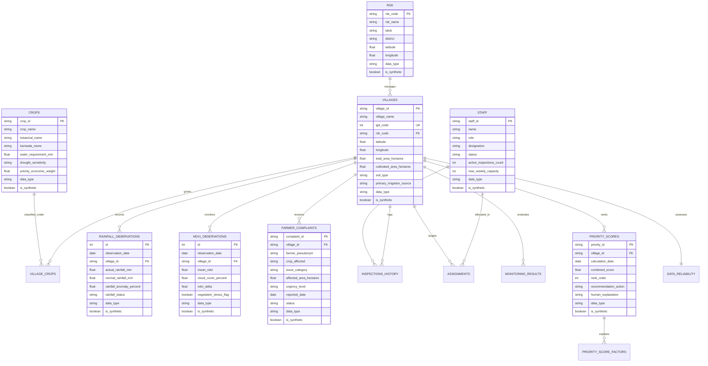

# Database Entity-Relationship (ER) Architecture

```mermaid
erDiagram
    RSK ||--o{ VILLAGES : manages
    VILLAGES ||--o{ VILLAGE_CROPS : grows
    CROPS ||--o{ VILLAGE_CROPS : classified_under
    VILLAGES ||--o{ RAINFALL_OBSERVATIONS : records
    VILLAGES ||--o{ NDVI_OBSERVATIONS : monitors
    VILLAGES ||--o{ FARMER_COMPLAINTS : receives
    VILLAGES ||--o{ INSPECTIONS_HISTORY : logs
    STAFF ||--o{ INSPECTIONS_HISTORY : conducts
    STAFF ||--o{ ASSIGNMENTS : allocated_to
    VILLAGES ||--o{ ASSIGNMENTS : targets
    VILLAGES ||--o{ MONITORING_RESULTS : evaluates
    VILLAGES ||--o{ PRIORITY_SCORES : ranks
    PRIORITY_SCORES ||--o{ PRIORITY_SCORE_FACTORS : explains
    VILLAGES ||--|| DATA_RELIABILITY : assesses

    RSK {
        string rsk_code PK
        string rsk_name
        string taluk
        string district
        float latitude
        float longitude
        string data_type
        boolean is_synthetic
    }

    VILLAGES {
        string village_id PK
        string village_name
        int lgd_code UK
        string rsk_code FK
        float latitude
        float longitude
        float total_area_hectares
        float cultivated_area_hectares
        string soil_type
        string primary_irrigation_source
        string data_type
        boolean is_synthetic
    }

    CROPS {
        string crop_id PK
        string crop_name
        string botanical_name
        string kannada_name
        float water_requirement_mm
        string drought_sensitivity
        float priority_economic_weight
        string data_type
        boolean is_synthetic
    }

    RAINFALL_OBSERVATIONS {
        int id PK
        date observation_date
        string village_id FK
        float actual_rainfall_mm
        float normal_rainfall_mm
        float rainfall_anomaly_percent
        string rainfall_status
        string data_type
        boolean is_synthetic
    }

    NDVI_OBSERVATIONS {
        int id PK
        date observation_date
        string village_id FK
        float mean_ndvi
        float cloud_cover_percent
        float ndvi_delta
        boolean vegetation_stress_flag
        string data_type
        boolean is_synthetic
    }

    FARMER_COMPLAINTS {
        string complaint_id PK
        string village_id FK
        string farmer_pseudonym
        string crop_affected
        string issue_category
        float affected_area_hectares
        string urgency_level
        date reported_date
        string status
        string data_type
        boolean is_synthetic
    }

    STAFF {
        string staff_id PK
        string name
        string role
        string designation
        string status
        int active_inspections_count
        int max_weekly_capacity
        string data_type
        boolean is_synthetic
    }

    PRIORITY_SCORES {
        string priority_id PK
        string village_id FK
        date calculation_date
        float combined_score
        int rank_order
        string recommendation_action
        string human_explanation
        string data_type
        boolean is_synthetic
    }
```
